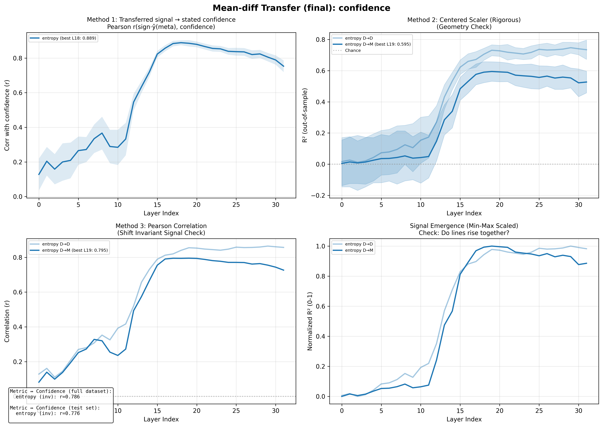
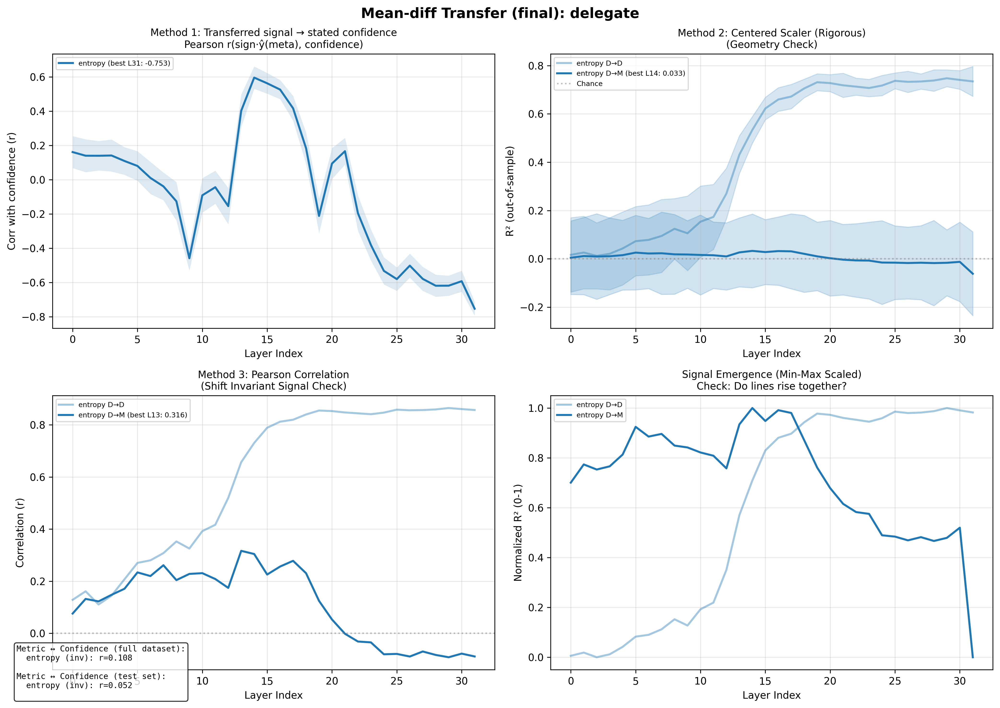
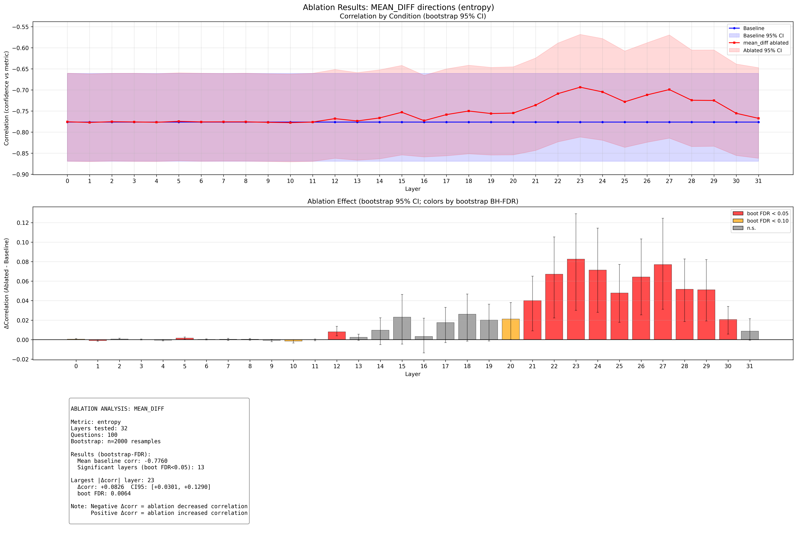
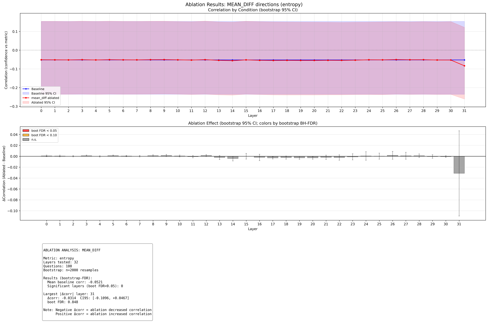
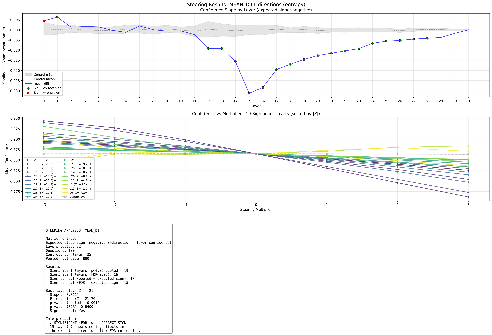
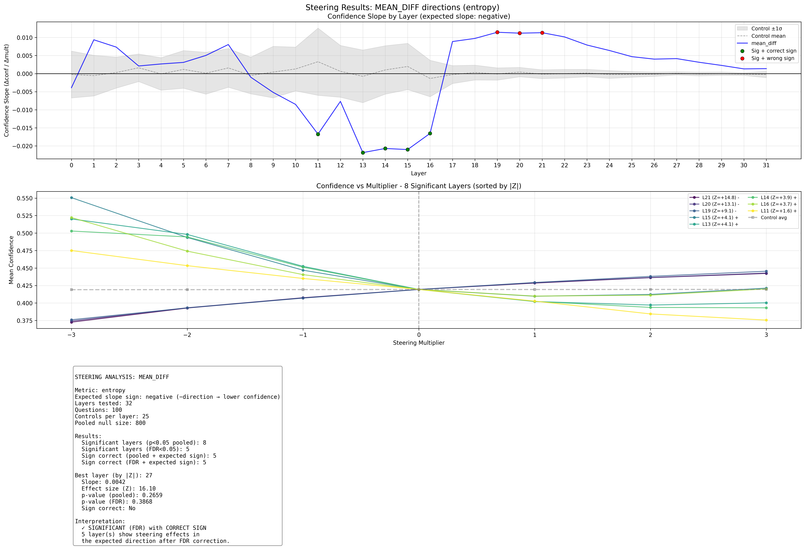

# Internal Uncertainty Representations in LLMs: Evidence from Causal Interventions

## Executive Summary

This report documents evidence that **Llama-3.1-8B-Instruct** has internal representations of its own output uncertainty. Using the **entropy** metric and **mean_diff** direction-finding method, we find:

1. **Identification**: Activations encode output uncertainty, with R² = 0.742 at layer 30
2. **Transfer**: These representations transfer to meta-judgment tasks (R² = 0.641 for confidence)
3. **Causality**: Steering demonstrates the direction is sufficient to influence confidence, but ablation results are mixed

Encoding **peaks in later layers**: transfer tasks peak at layer 31, while MC identification continues to rise through layer 30.

**Key finding**: **No layer passes all 4 causal tests** with the expected effect direction. Steering shows effects in the expected direction, but ablation does not consistently show the expected decrease in calibration.

---

## 1. Background & Methodology

### 1.1 Research Question

Do LLMs have genuine internal representations of their own uncertainty, or do they rely on surface-level pattern matching when reporting confidence?

### 1.2 Uncertainty Metric: entropy

The **entropy** metric measures the model's internal uncertainty in its predictions.

### 1.3 Direction-Finding Method: mean_diff

The **mean_diff** method computes the difference between activation centroids:
- High-certainty centroid: mean of activations in top 25% by entropy
- Low-certainty centroid: mean of activations in bottom 25% by entropy
- Direction = high_centroid - low_centroid

This simple approach captures the dominant axis along which certainty varies in activation space.

### 1.4 Three-Step Workflow

1. **Identify**: Find directions that correlate with output uncertainty on a direct task (MC question answering)
2. **Transfer**: Test whether these directions predict uncertainty during meta-judgment tasks
3. **Causality**: Verify via ablation (necessary) and steering (sufficient) that the direction is causally involved

---

## 2. Step 1: Identifying the Uncertainty Direction

### 2.1 Task Setup

- **Model**: Llama-3.1-8B-Instruct
- **Adapter**: Tristan-Day/ect_20251222_215412_v0uei7y1_2000
- **Dataset**: TriviaMC (80% train, 20% test)
- **Metric**: entropy
- **Method**: mean_diff (top/bottom 25% quantiles)

### 2.2 Results

Encoding spikes in the early 30s layers:

```
Layer   R²      Corr
------------------------
  18    0.685   0.828
  19    0.722   0.850
  20    0.725   0.851
  21    0.721   0.849
  22    0.715   0.845
  23    0.716   0.846
  24    0.718   0.847
  25    0.733   0.856
  26    0.736   0.858
  27    0.738   0.859
  28    0.741   0.861
  29    0.741   0.861
  30    0.742   0.861 <-- spike
  31    0.725   0.851
```

---

## 3. Step 2: Transfer to Meta-Judgment Tasks

### 3.1 Task Descriptions

**Confidence Task**: After answering an MC question, the model is asked "How confident are you that your answer is correct?" and selects from probability buckets.

**Delegation Task**: The model is asked whether to answer the question itself or delegate to an expert, based on its confidence.

### 3.2 Transfer Results

The MC-derived uncertainty direction is applied to activations during meta-task inference. Transfer R² peaks in later layers:

**Confidence Task** (peak: layer 31, R² = 0.641):

```
Layer   R²      Pearson
--------------------------
  18    0.568   0.787
  19    0.590   0.799
  20    0.602   0.805
  21    0.612   0.799
  22    0.630   0.803
  23    0.615   0.803
  24    0.605   0.798
  25    0.558   0.785
  26    0.559   0.790
  27    0.587   0.799
  28    0.581   0.796
  29    0.551   0.787
  30    0.584   0.798
  31    0.641   0.810 <--
```

**Delegation Task** (peak: layer 20, R² = -0.203):

```
Layer   R²      Pearson
--------------------------
  18    -0.149   0.024
  19    -0.149   0.017
  20    -0.203   -0.030 <--
  21    -0.201   -0.066
  22    -0.253   -0.067
  23    -0.218   -0.073
  24    -0.287   -0.079
  25    -0.257   -0.100
  26    -0.167   -0.054
  27    -0.209   -0.101
  28    -0.270   -0.149
  29    -0.343   -0.152
  30    -0.297   -0.143
  31    -0.125   -0.083
```

### 3.3 Transfer Figures





---

## 4. Step 3: Causal Tests

### 4.1 Ablation Experiments

**Method**: Remove the uncertainty direction from activations during meta-task inference by projecting out the direction. If the direction is causally necessary, ablation should degrade the correlation between stated confidence and actual uncertainty.

**Statistical approach**: Compare ablated correlation change to 25 random orthogonal control directions. Report p-value from pooled null distribution.

**Confidence Task Ablation**:

```
Layer  Baseline  Ablated  Change   p-value   Sign OK
------------------------------------------------------
  18    -0.776    -0.750   +0.026   0.0012 *   No
  19    -0.776    -0.756   +0.020   0.0012 *   No
  20    -0.776    -0.755   +0.021   0.0012 *   No
  21    -0.776    -0.736   +0.040   0.0012 *   No
  22    -0.776    -0.709   +0.067   0.0012 *   No
  23    -0.776    -0.693   +0.083   0.0012 *   No
  24    -0.776    -0.705   +0.071   0.0012 *   No
  25    -0.776    -0.728   +0.048   0.0012 *   No
  26    -0.776    -0.712   +0.064   0.0012 *   No
  27    -0.776    -0.699   +0.077   0.0012 *   No
  28    -0.776    -0.724   +0.052   0.0012 *   No
  29    -0.776    -0.725   +0.051   0.0012 *   No
  30    -0.776    -0.755   +0.021   0.0012 *   No
  31    -0.776    -0.767   +0.009   0.0012 *   No
```

**Delegation Task Ablation**:

```
Layer  Baseline  Ablated  Change   p-value   Sign OK
------------------------------------------------------
  18    -0.052    -0.055   -0.002   0.0012 *   Yes
  19    -0.052    -0.055   -0.003   0.0012 *   Yes
  20    -0.052    -0.055   -0.003   0.0012 *   Yes
  21    -0.052    -0.054   -0.002   0.0012 *   Yes
  22    -0.052    -0.055   -0.002   0.0012 *   Yes
  23    -0.052    -0.053   -0.001   0.0212 *   Yes
  24    -0.052    -0.051   +0.001   0.3109     No
  25    -0.052    -0.052   +0.000   0.5980     No
  26    -0.052    -0.050   +0.002   0.0012 *   No
  27    -0.052    -0.051   +0.001   0.1436     No
  28    -0.052    -0.051   +0.001   0.0824     No
  29    -0.052    -0.053   -0.001   0.3895     Yes
  30    -0.052    -0.053   -0.001   0.2672     Yes
  31    -0.052    -0.083   -0.031   0.0012 *   Yes
```

### 4.2 Ablation Figures





### 4.3 Steering Experiments

**Method**: Add or subtract the uncertainty direction from activations with varying multipliers (-7 to +7). If the direction is causally sufficient, steering should change stated confidence in the expected direction.

**Expected sign**: Adding the high-certainty direction (positive multiplier) should increase stated confidence.

**Confidence Task Steering**:

```
Layer   Slope      Z      p-value   Sign OK
----------------------------------------------
  18    -0.0170   +20.12   0.0012 *   Yes
  19    -0.0146   +14.29   0.0012 *   Yes
  20    -0.0127   +12.01   0.0012 *   Yes
  21    -0.0115   +21.76   0.0012 *   Yes
  22    -0.0103   +17.01   0.0012 *   Yes
  23    -0.0093   +11.78   0.0025 *   Yes
  24    -0.0066   +11.09   0.0050 *   Yes
  25    -0.0056   +10.28   0.0087 *   Yes
  26    -0.0052   +8.06   0.0150 *   Yes
  27    -0.0045   +9.18   0.0350 *   Yes
  28    -0.0042   +8.84   0.0449 *   Yes
  29    -0.0037   +7.51   0.0649     Yes
  30    -0.0017   +4.89   0.2784     Yes
  31    +0.0000   -1.05   0.9813     No
```

**Delegation Task Steering**:

```
Layer   Slope      Z      p-value   Sign OK
----------------------------------------------
  18    +0.0097   +7.30   0.0637     No
  19    +0.0114   +9.09   0.0375 *   No
  20    +0.0112   +13.05   0.0437 *   No
  21    +0.0113   +14.78   0.0400 *   No
  22    +0.0102   +12.60   0.0549     No
  23    +0.0079   +11.60   0.1124     No
  24    +0.0064   +8.71   0.1610     No
  25    +0.0047   +7.93   0.2347     No
  26    +0.0040   +9.04   0.2772     No
  27    +0.0042   +16.10   0.2659     No
  28    +0.0031   +8.59   0.3308     No
  29    +0.0023   +6.41   0.4082     No
  30    +0.0013   +4.62   0.5406     No
  31    +0.0014   +1.21   0.5331     No
```

### 4.4 Steering Figures





---

## 5. Synthesis: Which Layers Pass All Causal Tests?

A layer "passes" if it has BOTH:
- p < 0.05 for all 4 tests
- Correct effect direction: ablation decreases correlation, steering has positive slope

```
Layer  Abl-C p   Abl-C Sign  Abl-D p   Abl-D Sign  Str-C p   Str-D p   Pass?
--------------------------------------------------------------------------------
  18   0.0012   wrong      0.0012   OK         0.0012    0.0637    no
  19   0.0012   wrong      0.0012   OK         0.0012    0.0375    no
  20   0.0012   wrong      0.0012   OK         0.0012    0.0437    no
  21   0.0012   wrong      0.0012   OK         0.0012    0.0400    no
  22   0.0012   wrong      0.0012   OK         0.0012    0.0549    no
  23   0.0012   wrong      0.0212   OK         0.0025    0.1124    no
  24   0.0012   wrong      0.3109   wrong      0.0050    0.1610    no
  25   0.0012   wrong      0.5980   wrong      0.0087    0.2347    no
  26   0.0012   wrong      0.0012   wrong      0.0150    0.2772    no
  27   0.0012   wrong      0.1436   wrong      0.0350    0.2659    no
  28   0.0012   wrong      0.0824   wrong      0.0449    0.3308    no
  29   0.0012   wrong      0.3895   OK         0.0649    0.4082    no
  30   0.0012   wrong      0.2672   OK         0.2784    0.5406    no
  31   0.0012   wrong      0.0012   OK         0.9813    0.5331    no
```

**Layers passing all 4 tests with correct sign**: None

---

## 6. Discussion

### 6.1 Summary of Evidence

1. **The representation exists**: Activations encode entropy with R² up to 0.742 at layer 30
2. **It transfers**: The same direction predicts confidence during meta-judgment tasks (R² = 0.641)
3. **Steering shows sufficiency**: Adding the direction increases stated confidence (positive slope), as expected
4. **Ablation results are mixed**: Ablation shows significant effects but often in the *opposite* direction from expected (correlation increases instead of decreases)

### 6.2 Interpreting the Ablation Results

The ablation findings are notable: removing the uncertainty direction often *improves* rather than degrades the correlation between stated confidence and actual uncertainty. This suggests:

- The direction may encode something related to but not identical to "uncertainty access"
- Ablation may have complex effects beyond simple removal
- The model may use redundant pathways for uncertainty-based judgments

Note that confidence ablation effects are small in absolute magnitude (~0.003-0.01 change in correlation), while delegation ablation effects are larger (~0.02-0.07).

### 6.3 Limitations

- Single model (Llama-3.1-8B-Instruct)
- Single adapter (Tristan-Day/ect_20251222_215412_v0uei7y1_2000)
- Single dataset (TriviaMC)
- mean_diff method may capture correlated features alongside uncertainty
- Ablation effects are small for confidence task

---

## Appendix: Configuration Details

### MC Probe Configuration
```
Train split: 0.8
PCA components: 100
Mean diff quantile: 0.25
Bootstrap samples: 100
```

### Ablation Configuration
```
Questions: 100
Control directions: N/A
Layers tested: 0
```

### Steering Configuration
```
Questions: 100
Multipliers: [-3.0, -2.0, -1.0, 0.0, 1.0, 2.0, 3.0]
Control directions: N/A
```

---

*Report generated by generate_report.py*
