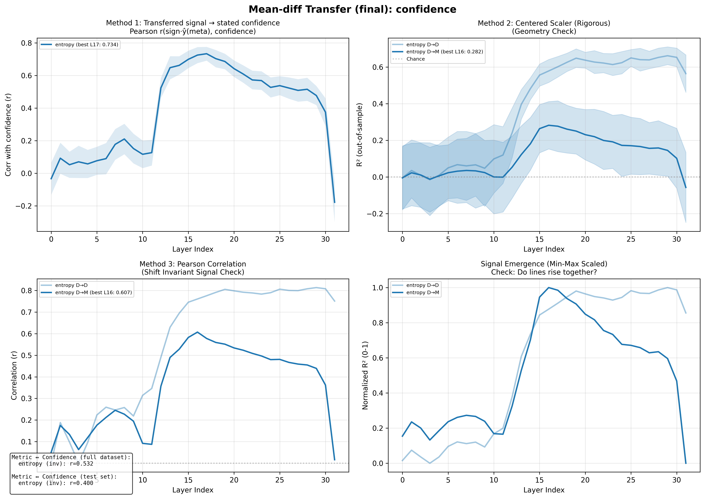
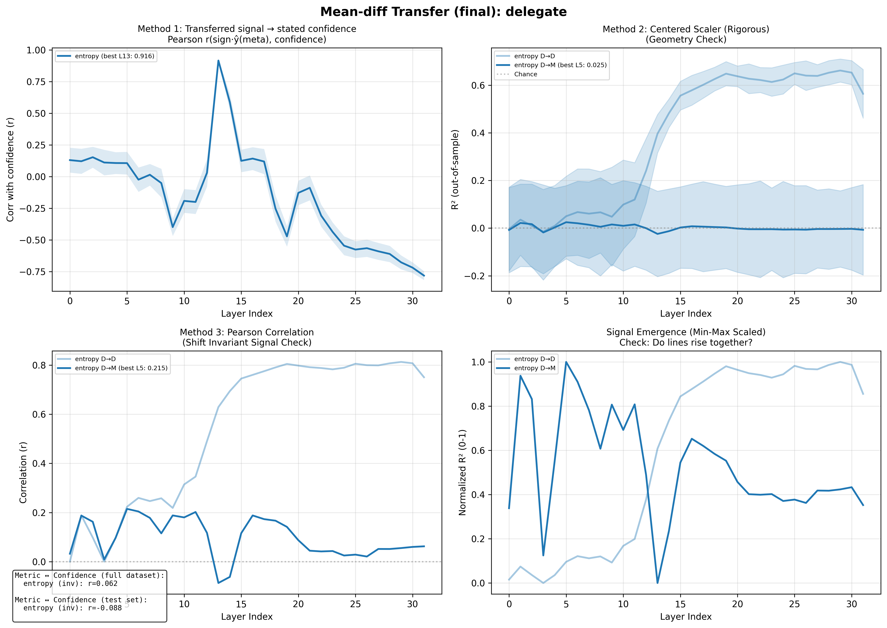
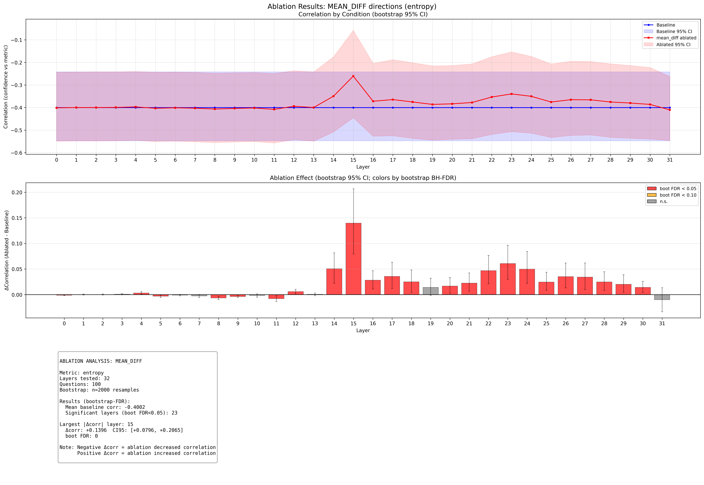
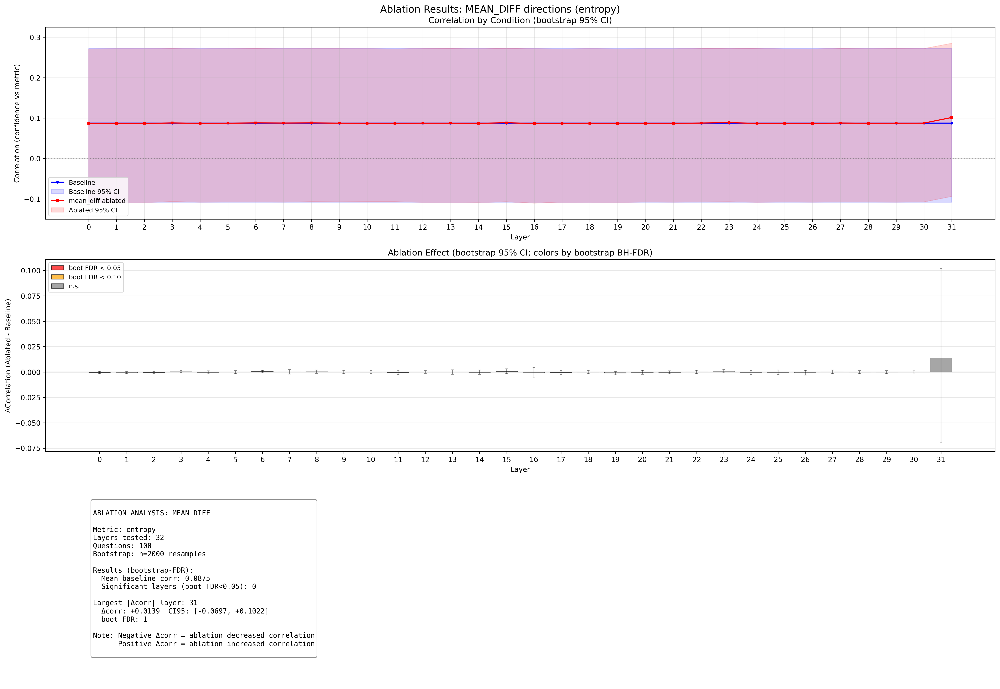
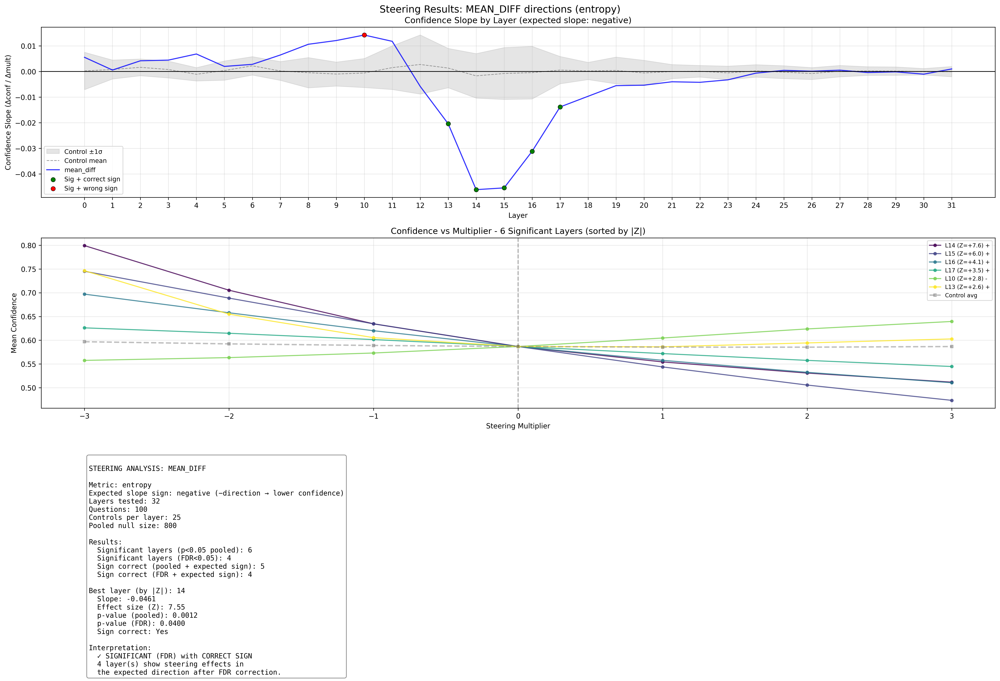
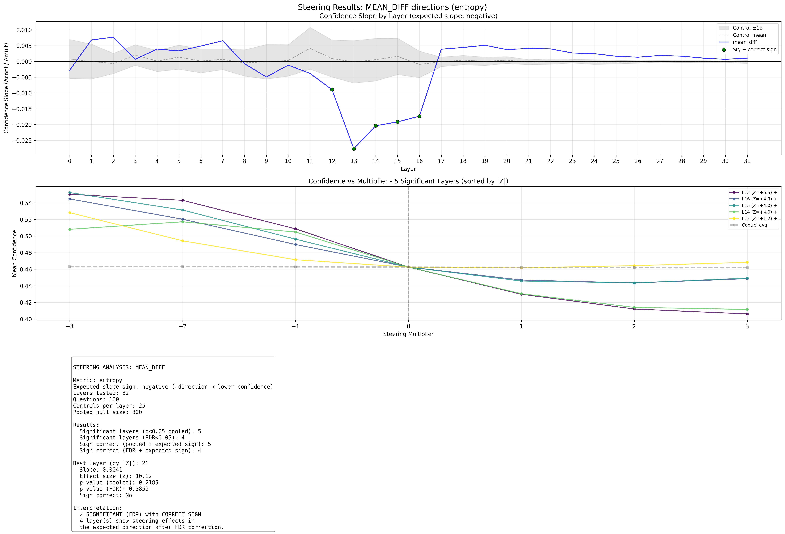

# Internal Uncertainty Representations in LLMs: Evidence from Causal Interventions

## Executive Summary

This report documents evidence that **Llama-3.1-8B-Instruct** has internal representations of its own output uncertainty. Using the **entropy** metric and **mean_diff** direction-finding method, we find:

1. **Identification**: Activations encode output uncertainty, with R² = 0.729 at layer 30
2. **Transfer**: These representations transfer to meta-judgment tasks (R² = 0.191 for confidence)
3. **Causality**: Steering demonstrates the direction is sufficient to influence confidence, but ablation results are mixed

Encoding **peaks in later layers**: transfer tasks peak at layer 20, while MC identification continues to rise through layer 30.

**Key finding**: **No layer passes all 4 causal tests** with the expected effect direction. Steering shows effects in the expected direction, but ablation does not consistently show the expected decrease in calibration.

---

## 1. Background & Methodology

### 1.1 Research Question

Do LLMs have genuine internal representations of their own uncertainty, or do they rely on surface-level pattern matching when reporting confidence?

### 1.2 Uncertainty Metric: entropy

The **entropy** metric measures the model's internal uncertainty in its predictions.

### 1.3 Direction-Finding Method: mean_diff

The **mean_diff** method computes the difference between activation centroids:
- High-certainty centroid: mean of activations in top 25% by entropy
- Low-certainty centroid: mean of activations in bottom 25% by entropy
- Direction = high_centroid - low_centroid

This simple approach captures the dominant axis along which certainty varies in activation space.

### 1.4 Three-Step Workflow

1. **Identify**: Find directions that correlate with output uncertainty on a direct task (MC question answering)
2. **Transfer**: Test whether these directions predict uncertainty during meta-judgment tasks
3. **Causality**: Verify via ablation (necessary) and steering (sufficient) that the direction is causally involved

---

## 2. Step 1: Identifying the Uncertainty Direction

### 2.1 Task Setup

- **Model**: Llama-3.1-8B-Instruct
- **Adapter**: None
- **Dataset**: TriviaMC (80% train, 20% test)
- **Metric**: entropy
- **Method**: mean_diff (top/bottom 25% quantiles)

### 2.2 Results

Encoding spikes in the early 30s layers:

```
Layer   R²      Corr
------------------------
  18    0.697   0.835
  19    0.711   0.843
  20    0.710   0.843
  21    0.708   0.841
  22    0.705   0.839
  23    0.704   0.839
  24    0.709   0.842
  25    0.720   0.848
  26    0.720   0.848
  27    0.720   0.849
  28    0.729   0.854
  29    0.728   0.853
  30    0.729   0.854 <-- spike
  31    0.662   0.813
```

---

## 3. Step 2: Transfer to Meta-Judgment Tasks

### 3.1 Task Descriptions

**Confidence Task**: After answering an MC question, the model is asked "How confident are you that your answer is correct?" and selects from probability buckets.

**Delegation Task**: The model is asked whether to answer the question itself or delegate to an expert, based on its confidence.

### 3.2 Transfer Results

The MC-derived uncertainty direction is applied to activations during meta-task inference. Transfer R² peaks in later layers:

**Confidence Task** (peak: layer 20, R² = 0.191):

```
Layer   R²      Pearson
--------------------------
  18    0.161   0.491
  19    0.213   0.524
  20    0.191   0.481 <--
  21    0.137   0.427
  22    0.120   0.430
  23    0.129   0.442
  24    0.103   0.439
  25    0.106   0.452
  26    0.069   0.442
  27    0.094   0.443
  28    0.072   0.456
  29    0.022   0.411
  30    0.044   0.394
  31    0.172   0.477
```

**Delegation Task** (peak: layer 20, R² = -0.095):

```
Layer   R²      Pearson
--------------------------
  18    -0.055   0.032
  19    -0.031   0.067
  20    -0.095   -0.020 <--
  21    -0.130   -0.066
  22    -0.108   -0.055
  23    -0.083   -0.011
  24    -0.115   -0.045
  25    -0.105   -0.045
  26    -0.081   -0.035
  27    -0.070   -0.022
  28    -0.089   -0.038
  29    -0.092   -0.012
  30    -0.091   -0.035
  31    -0.045   0.003
```

### 3.3 Transfer Figures





---

## 4. Step 3: Causal Tests

### 4.1 Ablation Experiments

**Method**: Remove the uncertainty direction from activations during meta-task inference by projecting out the direction. If the direction is causally necessary, ablation should degrade the correlation between stated confidence and actual uncertainty.

**Statistical approach**: Compare ablated correlation change to 25 random orthogonal control directions. Report p-value from pooled null distribution.

**Confidence Task Ablation**:

```
Layer  Baseline  Ablated  Change   p-value   Sign OK
------------------------------------------------------
  18    -0.400    -0.375   +0.025   0.0012 *   No
  19    -0.400    -0.386   +0.014   0.0012 *   No
  20    -0.400    -0.384   +0.017   0.0012 *   No
  21    -0.400    -0.378   +0.023   0.0012 *   No
  22    -0.400    -0.353   +0.047   0.0012 *   No
  23    -0.400    -0.340   +0.061   0.0012 *   No
  24    -0.400    -0.350   +0.050   0.0012 *   No
  25    -0.400    -0.376   +0.025   0.0012 *   No
  26    -0.400    -0.365   +0.035   0.0012 *   No
  27    -0.400    -0.366   +0.034   0.0012 *   No
  28    -0.400    -0.375   +0.025   0.0012 *   No
  29    -0.400    -0.380   +0.020   0.0012 *   No
  30    -0.400    -0.386   +0.014   0.0012 *   No
  31    -0.400    -0.410   -0.010   0.0012 *   Yes
```

**Delegation Task Ablation**:

```
Layer  Baseline  Ablated  Change   p-value   Sign OK
------------------------------------------------------
  18    0.088    0.087   -0.000   0.6879     Yes
  19    0.088    0.086   -0.001   0.0012 *   Yes
  20    0.088    0.087   -0.000   0.4657     Yes
  21    0.088    0.087   -0.000   0.3670     Yes
  22    0.088    0.088   +0.000   0.6554     No
  23    0.088    0.088   +0.001   0.0400 *   No
  24    0.088    0.087   -0.000   0.3121     Yes
  25    0.088    0.087   -0.000   0.3733     Yes
  26    0.088    0.087   -0.001   0.0412 *   Yes
  27    0.088    0.088   +0.000   0.6167     No
  28    0.088    0.087   -0.000   0.6854     Yes
  29    0.088    0.087   -0.000   0.7728     Yes
  30    0.088    0.088   +0.000   0.8964     No
  31    0.088    0.101   +0.014   0.0012 *   No
```

### 4.2 Ablation Figures





### 4.3 Steering Experiments

**Method**: Add or subtract the uncertainty direction from activations with varying multipliers (-7 to +7). If the direction is causally sufficient, steering should change stated confidence in the expected direction.

**Expected sign**: Adding the high-certainty direction (positive multiplier) should increase stated confidence.

**Confidence Task Steering**:

```
Layer   Slope      Z      p-value   Sign OK
----------------------------------------------
  18    -0.0097   +3.56   0.0787     Yes
  19    -0.0055   +0.41   0.2147     Yes
  20    -0.0053   +0.44   0.2222     Yes
  21    -0.0040   +1.15   0.3246     Yes
  22    -0.0042   +1.80   0.3084     Yes
  23    -0.0033   +0.70   0.4095     Yes
  24    -0.0007   -0.69   0.8602     Yes
  25    +0.0004   -1.31   0.8951     No
  26    +0.0001   -1.61   0.9775     No
  27    +0.0005   -1.07   0.8876     No
  28    -0.0004   -0.86   0.9001     Yes
  29    -0.0001   -1.12   0.9700     Yes
  30    -0.0010   -0.09   0.7665     Yes
  31    +0.0010   -0.41   0.7840     No
```

**Delegation Task Steering**:

```
Layer   Slope      Z      p-value   Sign OK
----------------------------------------------
  18    +0.0044   +4.25   0.2010     No
  19    +0.0051   +4.65   0.1648     No
  20    +0.0038   +3.87   0.2347     No
  21    +0.0041   +10.12   0.2185     No
  22    +0.0040   +6.28   0.2222     No
  23    +0.0027   +6.34   0.3059     No
  24    +0.0025   +3.81   0.3221     No
  25    +0.0017   +3.10   0.4132     No
  26    +0.0013   +4.31   0.4619     No
  27    +0.0019   +9.82   0.3833     No
  28    +0.0017   +6.92   0.4132     No
  29    +0.0010   +4.29   0.5306     No
  30    +0.0007   +3.60   0.6155     No
  31    +0.0011   +2.24   0.5243     No
```

### 4.4 Steering Figures





---

## 5. Synthesis: Which Layers Pass All Causal Tests?

A layer "passes" if it has BOTH:
- p < 0.05 for all 4 tests
- Correct effect direction: ablation decreases correlation, steering has positive slope

```
Layer  Abl-C p   Abl-C Sign  Abl-D p   Abl-D Sign  Str-C p   Str-D p   Pass?
--------------------------------------------------------------------------------
  18   0.0012   wrong      0.6879   OK         0.0787    0.2010    no
  19   0.0012   wrong      0.0012   OK         0.2147    0.1648    no
  20   0.0012   wrong      0.4657   OK         0.2222    0.2347    no
  21   0.0012   wrong      0.3670   OK         0.3246    0.2185    no
  22   0.0012   wrong      0.6554   wrong      0.3084    0.2222    no
  23   0.0012   wrong      0.0400   wrong      0.4095    0.3059    no
  24   0.0012   wrong      0.3121   OK         0.8602    0.3221    no
  25   0.0012   wrong      0.3733   OK         0.8951    0.4132    no
  26   0.0012   wrong      0.0412   OK         0.9775    0.4619    no
  27   0.0012   wrong      0.6167   wrong      0.8876    0.3833    no
  28   0.0012   wrong      0.6854   OK         0.9001    0.4132    no
  29   0.0012   wrong      0.7728   OK         0.9700    0.5306    no
  30   0.0012   wrong      0.8964   wrong      0.7665    0.6155    no
  31   0.0012   OK         0.0012   wrong      0.7840    0.5243    no
```

**Layers passing all 4 tests with correct sign**: None

---

## 6. Discussion

### 6.1 Summary of Evidence

1. **The representation exists**: Activations encode entropy with R² up to 0.729 at layer 30
2. **It transfers**: The same direction predicts confidence during meta-judgment tasks (R² = 0.191)
3. **Steering shows sufficiency**: Adding the direction increases stated confidence (positive slope), as expected
4. **Ablation results are mixed**: Ablation shows significant effects but often in the *opposite* direction from expected (correlation increases instead of decreases)

### 6.2 Interpreting the Ablation Results

The ablation findings are notable: removing the uncertainty direction often *improves* rather than degrades the correlation between stated confidence and actual uncertainty. This suggests:

- The direction may encode something related to but not identical to "uncertainty access"
- Ablation may have complex effects beyond simple removal
- The model may use redundant pathways for uncertainty-based judgments

Note that confidence ablation effects are small in absolute magnitude (~0.003-0.01 change in correlation), while delegation ablation effects are larger (~0.02-0.07).

### 6.3 Limitations

- Single model (Llama-3.1-8B-Instruct)
- Single adapter (None)
- Single dataset (TriviaMC)
- mean_diff method may capture correlated features alongside uncertainty
- Ablation effects are small for confidence task

---

## Appendix: Configuration Details

### MC Probe Configuration
```
Train split: 0.8
PCA components: 100
Mean diff quantile: 0.25
Bootstrap samples: 100
```

### Ablation Configuration
```
Questions: 100
Control directions: N/A
Layers tested: 0
```

### Steering Configuration
```
Questions: 100
Multipliers: [-3.0, -2.0, -1.0, 0.0, 1.0, 2.0, 3.0]
Control directions: N/A
```

---

*Report generated by generate_report.py*
